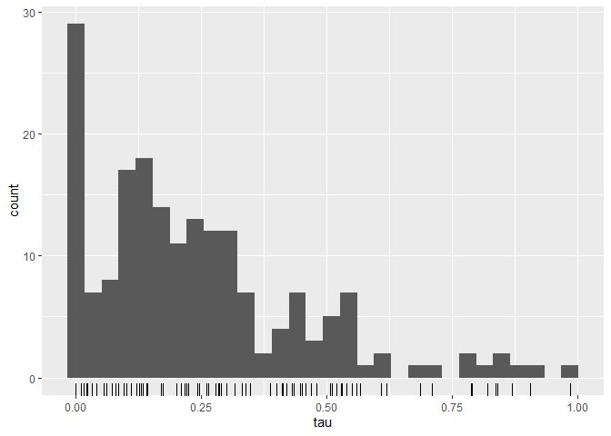
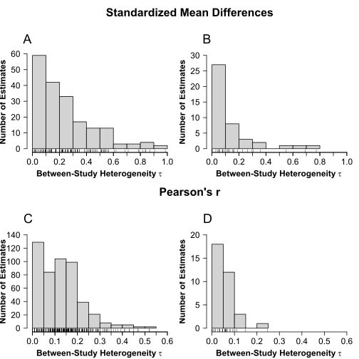

# Backtracing a Figure

This was a short effort to create a 2x2 panel plot requested by my
supervisor for a grant application.

I was asked to match the below figure from Van Erp et al. (2017), using
data from one of our papers (Olsson-Collentine, Wicherts, and van Assen
(2020)) and then to place the four plots into a 2x2 panel plot.

Figure 1.

Unfortunately, the original paper did not include code for how they
created their figures, so I was forced to reproduce their plot based the
figures and guess-work.

I recognized the little bars underneath the plot as something I have
tried once when I was exploring plots, but did not know their name.
After trying some different keywords in my search engine, I finally
stumbled on a post on stackoverflow (where else) that called these a
‘rug’ plot. Since I mostly use `ggplot` and this was where I had used
this plot before, I first tried this:

Figure 2.

    library(ggplot2)

    ggplot(erp_smd, aes(x = tau)) +
        geom_histogram() +
        geom_rug()

    ## `stat_bin()` using `bins = 30`. Pick better value with `binwidth`.

Figure 2 has the rug of Figure 1, but is otherwise not very similar. We
could play around with the binwidths to get a bit closer to Figure 1,
but at this point I noticed the difference in axis style between the two
plots. In my experience with ggplot, this was a potentially difficult to
solve problem, and some quick internet searches confirmed the suspicion.
At this point I tried the `base R` plot instead, and indeed there was a
rug command there and the default axes corresponded to Figure 1.

Figure 3.

    hist(erp_smd$tau)
    rug(erp_smd$tau)

In fact, this figure matches Figure 1 quite well already. We notice that
the bin width, the length of the axes, and the location of the tick
marks in the original figure apparently follow their defaults. The
difference in dimensions between the figures is something that is solved
in the saving of the figure.

With this we can start fiddling with the plot to try to get it to look
as similar as possible to Figure 1. Here are the things that we need to
fix:

-   Rename axis labels
-   Remove the title
-   Axis labels should be bold
-   The y axis tick labels need to be flipped
-   add minor tick marks to the x-axis

Because I never use base R plotting, I had no idea how to do any of
these and had to look them all up (although in fairness, I can never
remember how to do these things in `ggplot` either).

After quite some fiddling, I ended up with a plot like this.

Figure 4.

    hist(erp_smd$tau,
        xlab = expression(bold("Between-Study Heterogeneity" ~ tau)),
        ylab = "Number of Estimates",
        main = NULL, # title
        cex.lab = 1.5, cex.axis = 1.5, # label sizes
        las = 1, # change orientation of y-axis labels
        font.lab = 2, # bold labels, doesn't work on text inside expression()
    )
    rug(erp_smd$tau)
    Hmisc::minor.tick(nx = 2, ny = 1, tick.ratio = 1)

Looks good! Now I just wanted to put the figures into a 2x2 matrix with
some headers. With ggplot I would have used `cowplot` to do this. With
base plots we need to use the `layout` function to set things up. After
some data wrangling to get all datasets in the right shape for the
plots, and some adjustments to the basic plot for the different datasets
and for consistent plots, I ran the full code and saved the result as an
`svg` file.

    svg(
        filename = "heterogeneity.svg",
        width = 7,
        height = 7,
        pointsize = 12
    )
    # for base R we set the save before running the code

    par(mar=c(4,4,1,1)) #plot margins for the 4 sides
    layout(matrix(c(1, 1, 2, 3, 4, 4, 5, 6), #trick to get titles
        ncol = 2, byrow = TRUE),
        heights = c(1, 3, 1, 3)) #

    plot.new()
    text(0.5, 0.5, "Standardized Mean Differences", cex = 2, font = 2)
    # van erp SMD
    hist(erp_smd$tau,
        xlab = expression(bold("Between-Study Heterogeneity" ~ tau)),
        ylab = "Number of Estimates",
        main = NULL, #title
        cex.lab=1.5, cex.axis=1.5, #label sizes
        las = 1, #change orientation of y-axis labels
        font.lab = 2, #bold labels, doesn't work on text inside expression()
    )
    mtext(side=3, line=1, at=-0.07, adj=0, cex=1.5, "A") #print text on plot
    rug(erp_smd$tau)
    Hmisc::minor.tick(nx = 2, ny = 1, tick.ratio = 1)

    #Anton smd
    hist(anton_smd$tau,
        xlab = expression(bold("Between-Study Heterogeneity" ~ tau)),
        ylab = "Number of Estimates",
        main = NULL,
        cex.lab=1.5, cex.axis=1.5,
        las = 1,
        font.lab = 2,
        ylim = c(0, 30),
        xlim = c(0, 1)
    )
    mtext(side=3, line=1, at=-0.07, adj=0, cex=1.5, "B")
    rug(anton_smd$tau)
    minor.tick(nx = 2, ny = 1, tick.ratio = 1)

    plot.new()
    text(0.5,0.5,"Pearson's r",cex=2,font=2)
    # van erp r
    hist(erp_r$tau,
        xlab = expression(bold("Between-Study Heterogeneity" ~ tau)),
        ylab = "Number of Estimates",
        main = NULL,
        cex.lab = 1.5, cex.axis = 1.5,
        las = 1,
        font.lab = 2,
        ylim = c(0, 140),
        xlim = c(0, 0.6)
    )
    mtext(side=3, line=1, at=-0.04, adj=0, cex=1.5, "C")
    rug(erp_r$tau)
    minor.tick(nx = 2, ny = 1, tick.ratio = 1)

    # Anton r
    hist(anton_r$tau,
        xlab = expression(bold("Between-Study Heterogeneity" ~ tau)),
        ylab = "Number of Estimates",
        main = NULL,
        cex.lab = 1.5, cex.axis = 1.5,
        font.lab = 2,
        las = 1,
        ylim = c(0, 20),
        xlim = c(0, 0.6)
    )
    mtext(side=3, line=1, at=-0.04, adj=0, cex=1.5, "D")
    rug(anton_r$tau)

We then end up with this final figure, with the first column being based
on the data from Van Erp et al. (2017) and the second on data from
Olsson-Collentine, Wicherts, and van Assen (2020).

Figure 5.

# References

Olsson-Collentine, Anton, Jelte M. Wicherts, and Marcel A. L. M. van
Assen. 2020. “Heterogeneity in Direct Replications in Psychology and Its
Association with Effect Size.” *Psychological Bulletin*, July.
<https://doi.org/10.1037/bul0000294>.

Van Erp, Sara, Josine Verhagen, Raoul P. P. P. Grasman, and Eric-Jan
Wagenmakers. 2017. “Estimates of Between-Study Heterogeneity for 705
Meta-Analyses Reported in *Psychological Bulletin* From 1990–2013.”
*Journal of Open Psychology Data* 5 (1): 4.
<https://doi.org/10.5334/jopd.33>.
