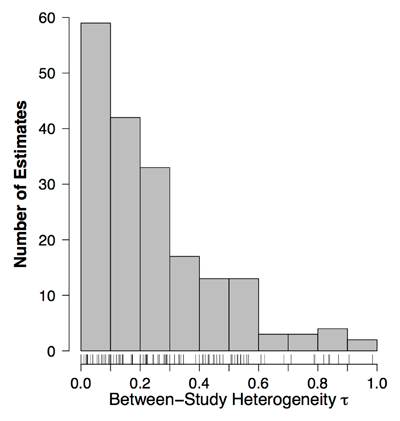
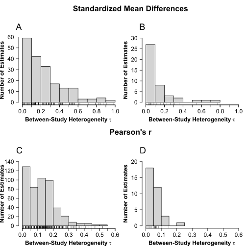

# Backtracing a Figure


```{r setup, include=FALSE}
knitr::opts_chunk$set(echo = TRUE, warning = FALSE)

erp <- read.csv("Data 1990-2013 with tau values.csv")
erp_smd <- erp[grepl("Cohen|Hedges", erp$Type.of.ES), ]
erp_r <- erp[grepl("Pearson", erp$Type.of.ES),]

anton_smd <- read.csv("anton_smd.csv")
anton_r <- read.csv("anton_r.csv")

anton_smd$tau <- sqrt(anton_smd$tau2)
```

This was a short effort to create a 2x2 panel plot requested by
my supervisor for a grant application.

I was asked to match the below figure from @10.5334/jopd.33, using data from
one of our papers (@10.1037/bul0000294) and then to place the four plots into a 2x2
panel plot.

Figure 1.

```{r, echo = FALSE}

```

Unfortunately, the original paper did not include code for how they
created their figures, so I was forced to reproduce their plot based
the figures and guess-work.

I recognized the little bars underneath the plot as something I have
tried once when I was exploring plots, but did not know their name.
After trying some different keywords in my search engine, I finally
stumbled on a post on stackoverflow (where else) that called these a
'rug' plot. Since I mostly use `ggplot` and this was where I had used
this plot before, I first tried this:

Figure 2.

```{r}
library(ggplot2)

ggplot(erp_smd, aes(x = tau)) +
    geom_histogram() +
    geom_rug()
```

Figure 2 has the rug of Figure 1, but is otherwise not very similar. We
could play around with the binwidths to get a bit closer to Figure 1, but
at this point I noticed the difference in axis style between the two plots.
In my experience with ggplot, this was a potentially difficult to solve
problem, and some quick internet searches confirmed the suspicion. At
this point I tried the `base R` plot instead, and indeed there was a rug
command there and the default axes corresponded to Figure 1.

Figure 3.
```{r, out.height="50%"}
hist(erp_smd$tau)
rug(erp_smd$tau)
```

In fact, this figure matches Figure 1 quite well already. We notice that the
bin width, the length of the axes, and the location of the tick marks in the
original figure apparently follow their defaults. The difference in dimensions
between the figures is something that is solved in the saving of the figure.

With this we can start fiddling with the plot to try to get it to look as
similar as possible to Figure 1. Here are the things that we need to fix:

- Rename axis labels
- Remove the title
- Axis labels should be bold
- The y axis tick labels need to be flipped
- add minor tick marks to the x-axis

Because I never use base R plotting, I had no idea how to do any
of these and had to look them all up (although in fairness, I can never remember
how to do these things in `ggplot` either).

After quite some fiddling, I ended up with a plot like this.

Figure 4.

```{r, out.height="50%"}
hist(erp_smd$tau,
    xlab = expression(bold("Between-Study Heterogeneity" ~ tau)),
    ylab = "Number of Estimates",
    main = NULL, # title
    cex.lab = 1.5, cex.axis = 1.5, # label sizes
    las = 1, # change orientation of y-axis labels
    font.lab = 2, # bold labels, doesn't work on text inside expression()
)
rug(erp_smd$tau)
Hmisc::minor.tick(nx = 2, ny = 1, tick.ratio = 1)
```

Looks good! Now I just wanted to put the figures into a 2x2 matrix with some
headers. With ggplot I would have used `cowplot` to do this. With base plots we
need to use the `layout` function to set things up. After some data wrangling to
get all datasets in the right shape for the plots, and some adjustments to the
basic plot for the different datasets and for consistent plots, I ran the full
 code and saved the result as an `svg` file.

```{r, eval = FALSE}
svg(
    filename = "heterogeneity.svg",
    width = 7,
    height = 7,
    pointsize = 12
)
# for base R we set the save before running the code


par(mar=c(4,4,1,1)) #plot margins for the 4 sides
layout(matrix(c(1, 1, 2, 3, 4, 4, 5, 6), #trick to get titles
    ncol = 2, byrow = TRUE),
    heights = c(1, 3, 1, 3)) #

plot.new()
text(0.5, 0.5, "Standardized Mean Differences", cex = 2, font = 2)
# van erp SMD
hist(erp_smd$tau,
    xlab = expression(bold("Between-Study Heterogeneity" ~ tau)),
    ylab = "Number of Estimates",
    main = NULL, #title
    cex.lab=1.5, cex.axis=1.5, #label sizes
    las = 1, #change orientation of y-axis labels
    font.lab = 2, #bold labels, doesn't work on text inside expression()
)
mtext(side=3, line=1, at=-0.07, adj=0, cex=1.5, "A") #print text on plot
rug(erp_smd$tau)
Hmisc::minor.tick(nx = 2, ny = 1, tick.ratio = 1)

#Anton smd
hist(anton_smd$tau,
    xlab = expression(bold("Between-Study Heterogeneity" ~ tau)),
    ylab = "Number of Estimates",
    main = NULL,
    cex.lab=1.5, cex.axis=1.5,
    las = 1,
    font.lab = 2,
    ylim = c(0, 30),
    xlim = c(0, 1)
)
mtext(side=3, line=1, at=-0.07, adj=0, cex=1.5, "B")
rug(anton_smd$tau)
minor.tick(nx = 2, ny = 1, tick.ratio = 1)

plot.new()
text(0.5,0.5,"Pearson's r",cex=2,font=2)
# van erp r
hist(erp_r$tau,
    xlab = expression(bold("Between-Study Heterogeneity" ~ tau)),
    ylab = "Number of Estimates",
    main = NULL,
    cex.lab = 1.5, cex.axis = 1.5,
    las = 1,
    font.lab = 2,
    ylim = c(0, 140),
    xlim = c(0, 0.6)
)
mtext(side=3, line=1, at=-0.04, adj=0, cex=1.5, "C")
rug(erp_r$tau)
minor.tick(nx = 2, ny = 1, tick.ratio = 1)

# Anton r
hist(anton_r$tau,
    xlab = expression(bold("Between-Study Heterogeneity" ~ tau)),
    ylab = "Number of Estimates",
    main = NULL,
    cex.lab = 1.5, cex.axis = 1.5,
    font.lab = 2,
    las = 1,
    ylim = c(0, 20),
    xlim = c(0, 0.6)
)
mtext(side=3, line=1, at=-0.04, adj=0, cex=1.5, "D")
rug(anton_r$tau)


```

We then end up with this final figure, with the first column being based on the
data from @10.5334/jopd.33 and the second on data from @10.1037/bul0000294.

Figure 5.

```{r, echo = FALSE}

```


# References
